# Hello everyone

# Дар ин readme file дар бораи методҳои string каме маълумот ҳаст

# 1 - Create String in js
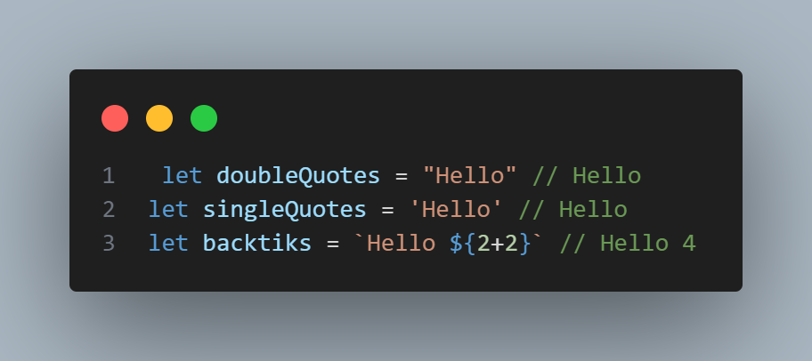

# Акнун дар бораи методҳо гап мезанем 
# Пас савол ба миён меояд Метод чист?
# - Методҳо дар JavaScript - ин функсияҳое ҳастанд, ки ба объектҳо тааллуқ доранд ва барои иҷрои амалҳои муайян дар доираи ин объектҳо истифода мешаванд. Ҳар як объект метавонад методҳои хосе дошта бошад, ки амалиётҳои гуногунро иҷро мекунанд.
# String - Methods
- charAt(), at()
- toString()
- concat()
- trim()
- includes()
- indexOf(), lastIndexOf()
- replace(),replaceAll()
- substring(), slice()
- split()
- toLowerCase(),toUpperCase()

# charAt()
## Методи .charAt() дар JavaScript барои дастрас кардани хати хосе аз як сатри (string) дода шуда истифода мешавад. Он хати ҳосилкардаи индекс ё ҷойи муайян дар сатри маълумро бармегардонад.
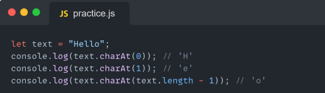
# at()
## Метод .at() дар JavaScript барои дастрас кардани хати хосе дар як сатри (string) ё массив истифода мешавад, ки бо истифода аз индекси манфӣ ё мусбат муайян мешавад. Ин метод дар версияҳои нави JavaScript (ECMAScript 2022) муаррифӣ шудааст ва имконият медиҳад, ки арзишро тавассути индексҳои манфӣ, ки аз охир оғоз мешаванд, дастрас кунем.
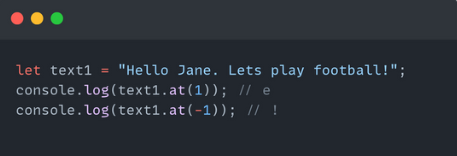
# toString()
## Элементро ба string мегардонад
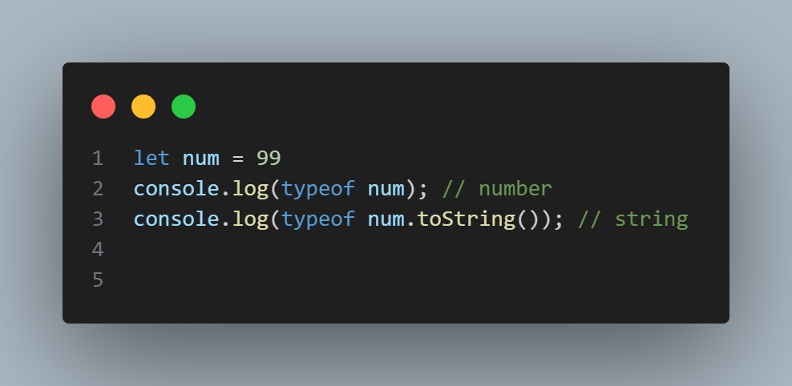
# concat()
## Як чандто маълумотҳоро якҷоя мекунад
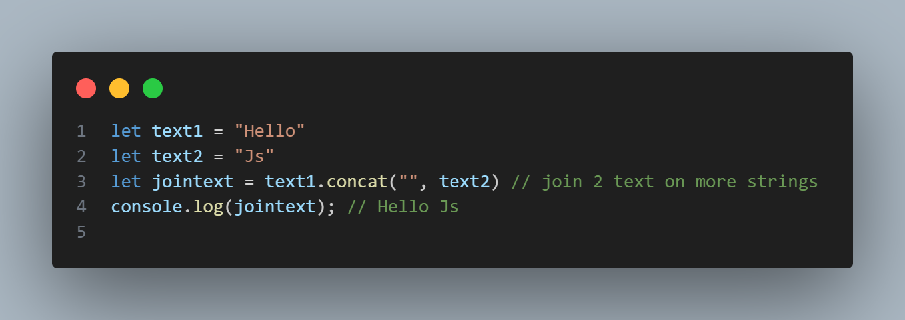
# trim()
## Барои пробелҳои чапу роста гум кардан
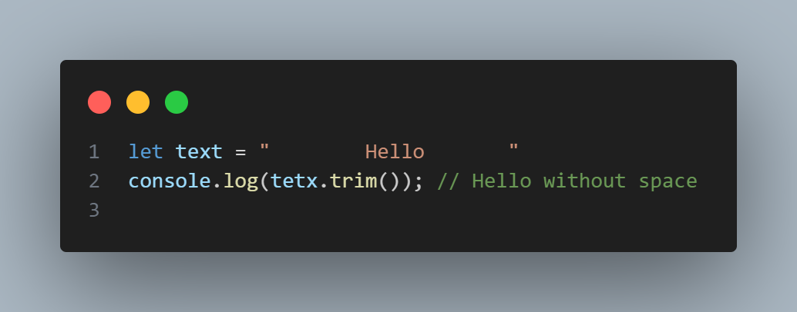
# includes()
## барои тафтиш кардани текст ва агар дар он ҷо елементе ки набошад true & false бармегардонад
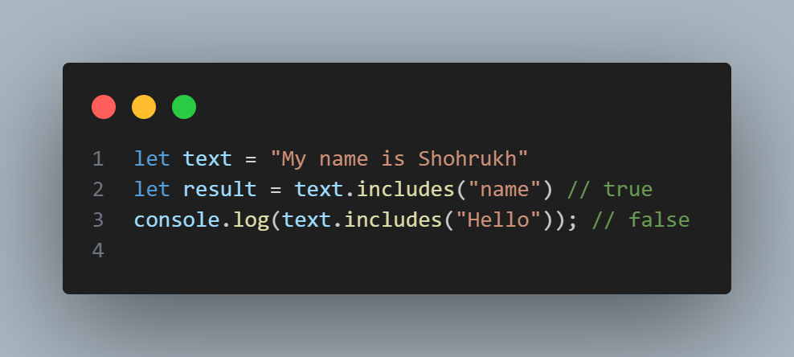
# indexOf()
## дар ин метод шумо элементро менависед ва индекси онро бармегардонад
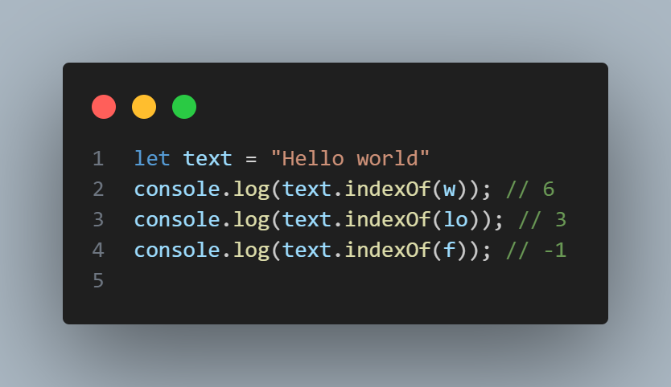
# replace()
## Барои иваз кардани элеметҳо истифода бурда мешавад
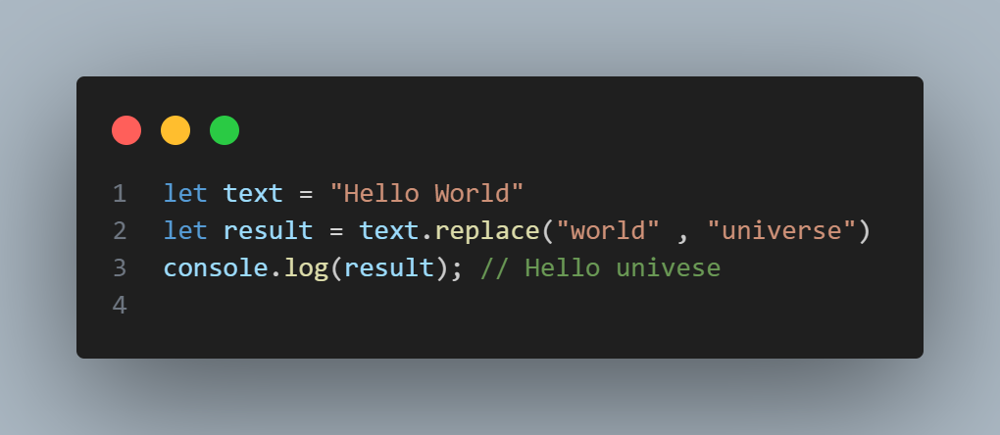
# substring
##  дар ин метод шумо метавонед саршавии ва тамомшавии текстро монед
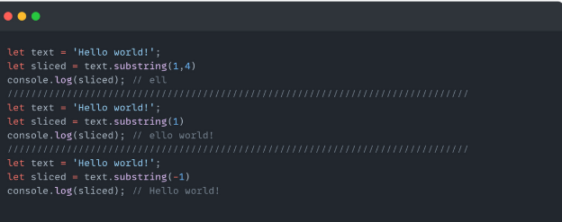
# slice()
## мисои Substring аст ва бо он фарқият мекунад ки дар параметри худ адаи манфиро қабул карда метавонад
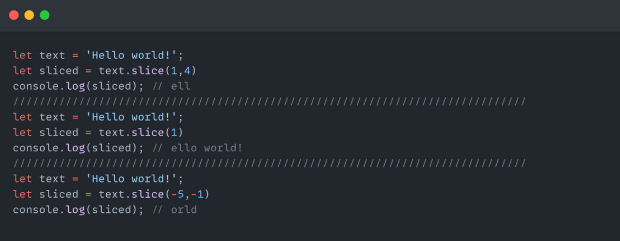
# toLowerCase
## ҳама элеменҳоро хурд мекунад
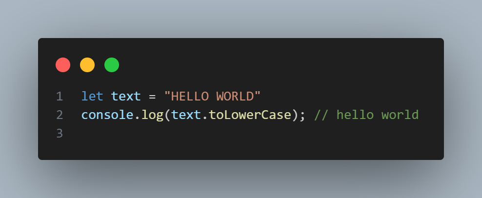
# toUpperCase
## Ҳамма элеменҳоро калон мекунад
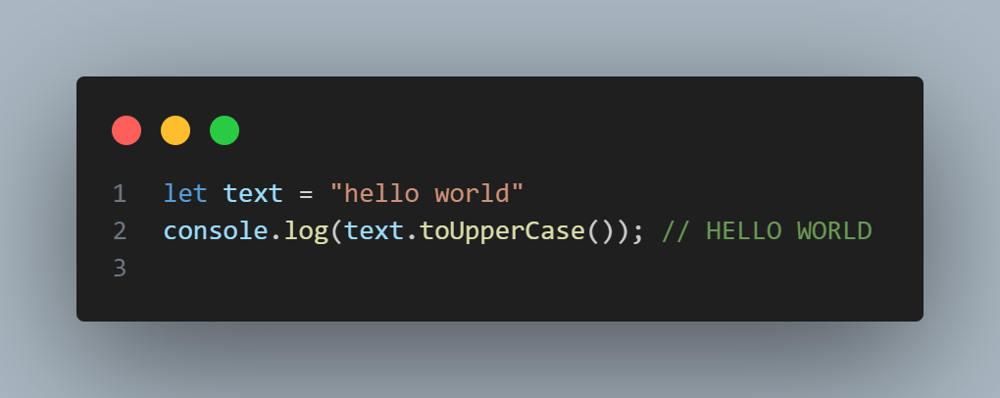
# split()
## Элеменҳоро ба Массив мегардонад
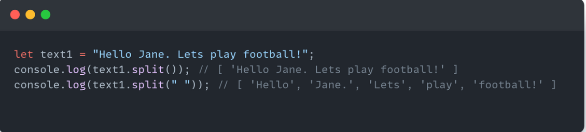
